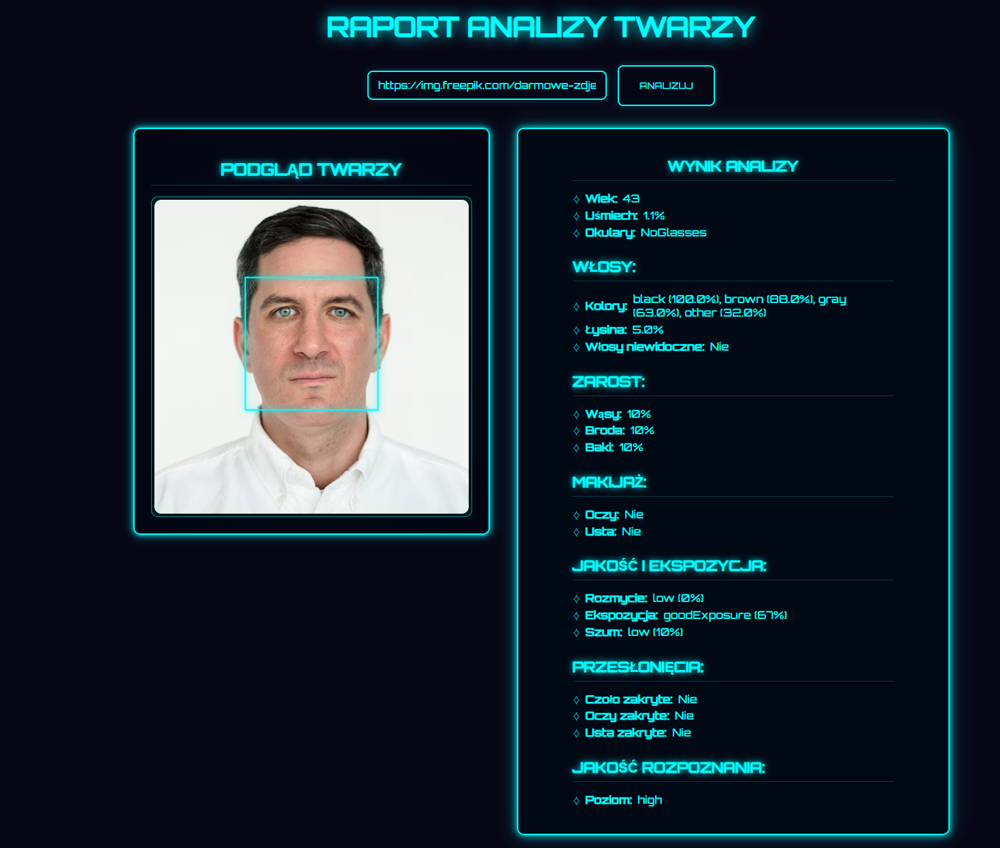

# 🧠 Face Analysis App

A futuristic full-stack application that analyzes facial features using the **Azure Face API**.  
Built with a **React frontend** and a **Spring Boot backend**, wrapped in a sci-fi inspired user interface.

🌐 **Live demo:** [https://face-detector-app.netlify.app/](https://face-detector-app.netlify.app/)

---

## 📸 Features

- Paste a URL to a photo
- Analyze facial attributes such as:
  - Age, gender, smile
  - Glasses, facial hair, makeup
  - Hair color, baldness, visibility
  - Blur, exposure, noise, recognition quality
- Live canvas preview with bounding box
- Beautiful HUD-style interface
- Full-stack setup using React + Spring Boot + Azure API

---

## 📸 Features

- Paste a URL to a photo and analyze facial attributes
- Extracted features include:
  - ✅ Age, gender, smile
  - ✅ Glasses, facial hair, makeup
  - ✅ Hair color, baldness, visibility
  - ✅ Blur, exposure, noise, quality for recognition
- Live canvas preview with facial bounding box
- Modern neon / HUD-style user interface
- Full-stack architecture:
  - **Frontend:** React 
  - **Backend:** Spring Boot + Azure Face API
  - **Database:** MongoDB Atlas
- Filtering faces by attributes via dynamic form

---

## 💻 Preview

 <!-- <- Replace with your real app screenshot -->

---
